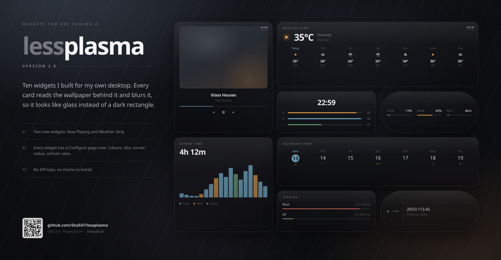
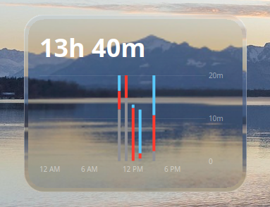
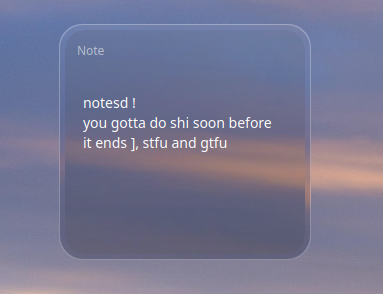
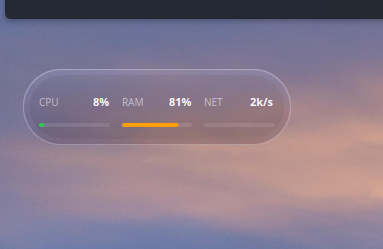
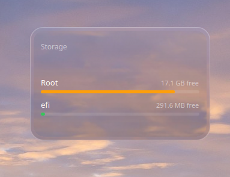
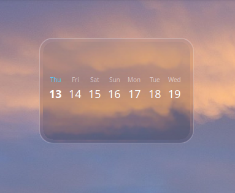
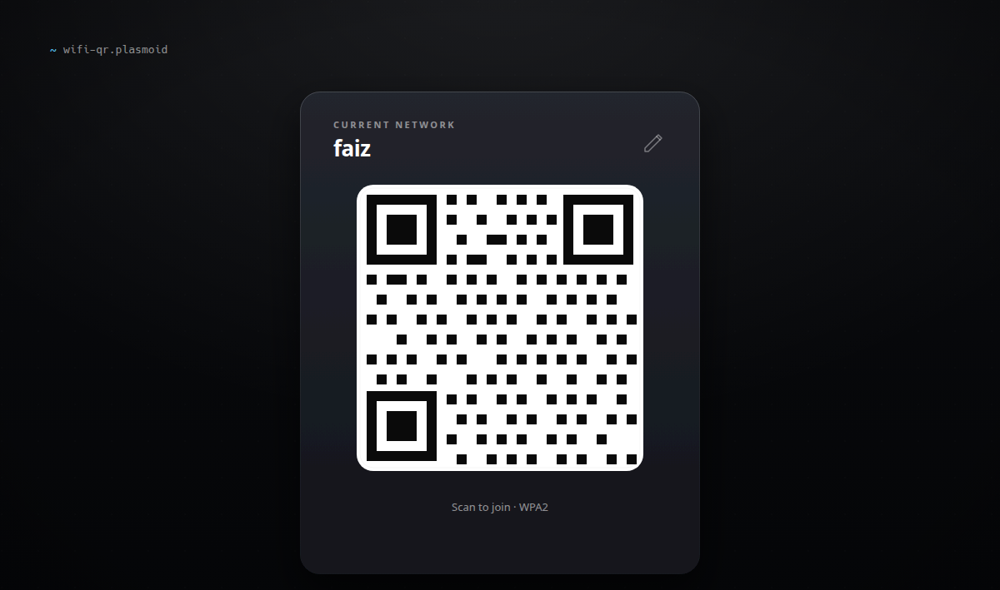
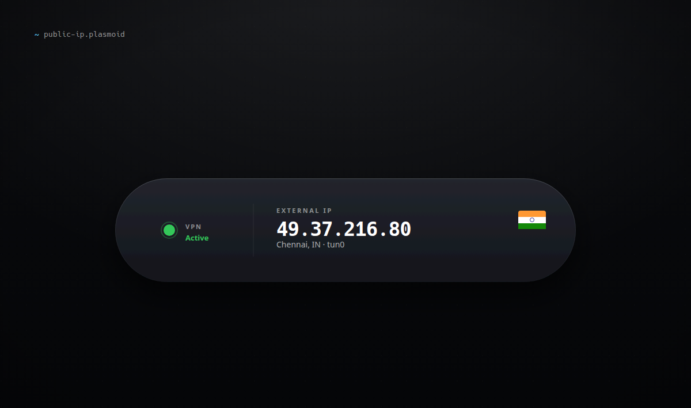
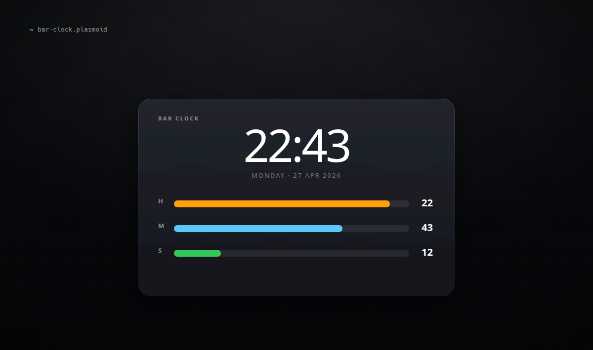

<p align="center">
    <a href="https://github.com/Sha547/lessplasma/releases/latest"></a>
    
    
</p>

Ten widgets I built for my own desktop. Dark, frosted glass, dot-friendly, no theme to install. If you like one, take it; the rest are independent.

---

```
$ cat lessplasma.manifest

# ten widgets, all dark, all responsive

screen-time      →  per-app usage by the hour
sticky-note      →  editable note, autosaves
system-pulse     →  CPU / RAM / Net live bars
disk-usage       →  used/free per drive
calendar-strip   →  7-day strip or full month grid
wifi-qr          →  scannable QR for current network
public-ip        →  external IP, country, VPN status
bar-clock        →  time as three filling bars
now-playing      →  track, cover art, transport controls
weather-strip    →  7-day forecast, no API key

# each widget is its own folder under packages/
# install:  ./install.sh
# reload:   kquitapp6 plasmashell && kstart plasmashell
```

---

## Screen Time `packages/screen-time`



This is the only widget here that's more than a single QML file. There's a Python daemon running as a systemd user service, plus a small KWin script that fires on every window-focus change and tells the daemon what window you switched to. The daemon keeps a running tally of seconds per app per hour in SQLite, ignores time when you're idle (it asks `org.freedesktop.ScreenSaver` how long it's been), and the widget polls it every 15 seconds.

If a category in the chart says "Other" and you don't recognize what's in it, edit `~/.local/share/plasma-screentime/categories.json` and the widget will pick the change up automatically.

## Sticky Note `packages/sticky-note`



A `TextArea` that saves to plasmoid config 600ms after you stop typing. That's the whole widget.

## System Pulse `packages/system-pulse`



Reads `/proc/stat`, `/proc/meminfo`, `/proc/net/dev` every two seconds. CPU and network are deltas between two reads, RAM is `MemTotal - MemAvailable`. Bars go green, then orange, then red as load climbs.

## Disk Usage `packages/disk-usage`



One row per mounted drive, colored by fullness. The hard part was getting `df` to ignore the dozens of fake filesystems Linux mounts (tmpfs, snap, fuse, overlays) and only show real disks.

## Calendar Strip `packages/calendar-strip`



Seven days with a dot for each upcoming event. Drag the corner to make it taller and it switches to a full month grid, with today highlighted as a blue circle. Events come from `DTSTART` lines in your local `.ics` files (Akonadi resources, KOrganizer, anything in `~/.local/share/calendars`). Online-only calendars won't show up; that's a different data source.

## WiFi QR `packages/wifi-qr`



SSID is auto-detected. Set your password once in right-click → **Configure**; it lives in plasmoid config locally. No QR is generated until the payload is actually connectable, so you never get a code that silently fails to join. `qrencode` renders the standard `WIFI:T:WPA;S:<ssid>;P:<pass>;;` payload to a PNG and any phone camera reads it.

## Public IP `packages/public-ip`



Pulls IP, city, country from `ipinfo.io` once a minute. The VPN dot is just `ip link show` greppped for `tun*`, `wg*`, `tap*`, `nordlynx`. It's not foolproof. A VPN running through an `eth*` interface won't trigger it, but it covers most setups.

## Bar Clock `packages/bar-clock`



Hours, minutes, seconds as three filling bars. The seconds bar is the only one you'll catch moving.

## Now Playing `packages/now-playing`

Whatever's playing right now: title, artist, progress, and prev/play/next. It talks to any MPRIS player (Spotify, VLC, mpv, browsers, Elisa) over D-Bus via `qdbus6`, so there's nothing extra to install. If the player publishes cover art, the art gets blurred into the card behind the text.

If several players are open it prefers whichever is actually playing, falling back to the first one it finds.

## Weather Strip `packages/weather-strip`

Seven days across, each with an icon and a high/low. Drag it taller and the current conditions get their own header above the strip.

Data comes from [Open-Meteo](https://open-meteo.com). It's free, with no API key and no signup, so it works the moment you add it. Location is detected from your IP via the same `ipinfo.io` lookup Public IP uses; if you'd rather not rely on that (or your IP geolocates somewhere silly), put explicit coordinates in **Configure**. Celsius by default, Fahrenheit is a checkbox.

The forecast fetch lives in `contents/code/weather.py` rather than being wedged into a shell one-liner, so you can run it directly to see exactly what the widget sees:

```bash
python3 packages/weather-strip/contents/code/weather.py          # auto-locate
python3 packages/weather-strip/contents/code/weather.py 48.85 2.35 c 7
```

---

## A note on the glass

Every card is real frosted glass, not a translucent rectangle. KWin's blur effect can't help here. A desktop widget lives inside the same plasmashell window that paints your wallpaper, so there's nothing behind it to composite. Instead each widget reads your wallpaper, aligns a crop of it to the widget's own position on screen, blurs that, and masks it to the card. A second, magnified copy is confined to the border ring, which is what gives the edge its refraction.

Slideshow wallpapers have no single image to sample, so those fall back to a plain tint. Blur and tint strength are per-widget settings under **Configure**.

---

## Install

You'll need:

| Distro | Command |
|---|---|
| Debian / Ubuntu / Neon | `sudo apt install qt6-tools python3-dbus python3-gi curl` |
| Arch | `sudo pacman -S qt6-tools python-dbus python-gobject curl` |
| Fedora | `sudo dnf install qt6-qttools python3-dbus python3-gobject curl` |

Plus `qrencode` if you want WiFi QR.

```bash
git clone https://github.com/Sha547/lessplasma.git
cd lessplasma
./install.sh                  # all widgets
./install.sh sticky-note      # just one
```

The installer checks deps upfront, registers each plasmoid via `kpackagetool6`, sets up the Screen Time daemon, and reloads `plasmashell` for you. Once that's done, right-click desktop → **Add Widgets** → search the widget name.

If you'd rather install via "Install Widget From Local File" in the picker, grab a `.plasmoid` from the [Releases](https://github.com/Sha547/lessplasma/releases) page (or build them yourself with `./package.sh --all`, which outputs to `packaged/`).

## Develop

Quick preview of one widget without touching your live desktop:

```bash
./test.reload.sh sticky-note
```

This launches `plasmoidviewer` (or `plasmoidviewer6`, depending on your distro) against the source folder, so edits to the QML show up on the next `./test.reload.sh` run.

## Configure

Every widget has a right-click → **Configure** page for refresh intervals, colors, thresholds, and glass blur/tint.

- **Screen Time**: categories live at `~/.local/share/plasma-screentime/categories.json`. Edit to add your apps (substring match).
- **WiFi QR**: right-click → Configure to set your password.
- **Sticky Note**: just type.

## Uninstall

```bash
./uninstall.sh
```

Plasmoids and daemon go. Your usage data at `~/.local/share/plasma-screentime/` stays unless you delete it.

## Credits

Massive thanks to my friend **Jack Faith ([@jaxparrow07](https://github.com/jaxparrow07))**. His [**nothingkdewidgets**](https://github.com/jaxparrow07/nothing-kde-widgets) pack is what got me into building these in the first place. The install-script structure and packaging conventions in this repo are based on his. His widgets are also genuinely beautiful, go install them.

## License

[GPL-3.0-or-later](LICENSE).
