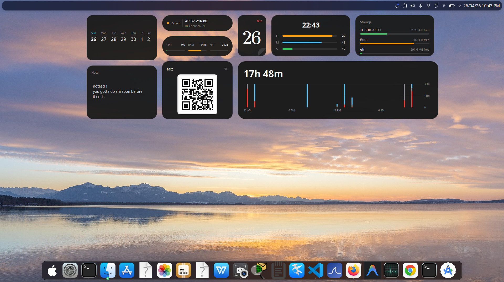
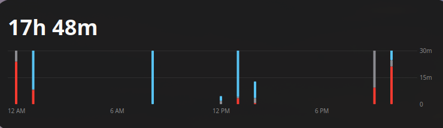
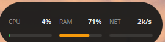
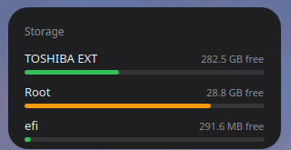
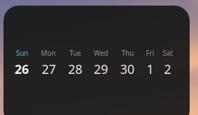
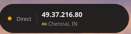
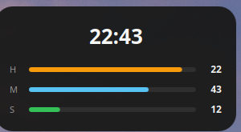

# lessplasma



<p align="center">
    <i>v0.1</i><br>
    Minimal widgets for KDE Plasma 6. Eight widgets, one aesthetic, zero bloat.<br><br>
    <a href="https://github.com/Sha547/lessplasma/releases/latest">
        
    </a>
    
    
</p>

---

## Available Widgets

| Widget | Package | Description | Preview |
|---|---|---|---|
| **Screen Time** | `screen-time` | Per-app usage with hourly stacked-bar chart, category breakdown, and top apps grid. Backed by a Python DBus daemon + KWin script. |  |
| **Sticky Note** | `sticky-note` | Single editable note. Autosaves to plasmoid config 600 ms after you stop typing. |  |
| **System Pulse** | `system-pulse` | CPU / RAM / Net live bars in a pill. Reads `/proc` every 2s. Color shifts green → orange → red as load climbs. |  |
| **Disk Usage** | `disk-usage` | Per-drive used/free bars from `df`. Green <70%, orange 70–85%, red >85%. |  |
| **Calendar Strip** | `calendar-strip` | 7-day strip with event dots. Resize taller for full month grid with today highlighted as a blue circle. |  |
| **WiFi QR** | `wifi-qr` | Scannable QR for current WiFi. Local generation via `qrencode` — password never leaves the machine. |  |
| **Public IP** | `public-ip` | External IP, country flag, city, and VPN status (detects `tun*`/`wg*`/`tap*` interfaces). |  |
| **Bar Clock** | `bar-clock` | Time as three filling bars: hours / minutes / seconds. Time text on top. |  |

---

## Installation

### Method 1: Install Script (Recommended)

**Prerequisites:**
- KDE Plasma 6.0 or higher
- `kpackagetool6`, `qdbus6`, `python3` with `dbus` and `gi`, `curl`
- `qrencode` (optional, only for WiFi QR widget)

| Distro | Install command |
|---|---|
| Debian / Ubuntu / Neon | `sudo apt install qt6-tools python3-dbus python3-gi curl qrencode` |
| Arch | `sudo pacman -S qt6-tools python-dbus python-gobject curl qrencode` |
| Fedora | `sudo dnf install qt6-qttools python3-dbus python3-gobject curl qrencode` |

Clone the repository and run the install script:

```bash
git clone https://github.com/Sha547/lessplasma.git
cd lessplasma
./install.sh
```

Then reload Plasma:

```bash
kquitapp6 plasmashell && kstart plasmashell
```

The script installs all eight widgets, sets up the Screen Time daemon as a systemd user service, and registers the KWin tracker script. It checks dependencies upfront and prints distro-specific install hints for anything missing.

### Method 2: Install a Single Widget Manually

```bash
kpackagetool6 -t Plasma/Applet -i packages/<package-name>
```

For example:

```bash
kpackagetool6 -t Plasma/Applet -i packages/sticky-note
```

The Screen Time widget needs extra setup beyond the plasmoid:

```bash
# Install the daemon binary
install -m 0755 packages/screen-time/daemon/screentime-daemon.py ~/.local/bin/screentime-daemon
# Install systemd user unit
install -m 0644 packages/screen-time/daemon/screentime-daemon.service ~/.config/systemd/user/
systemctl --user daemon-reload
systemctl --user enable --now screentime-daemon

# Install the KWin script that feeds it events
kpackagetool6 -t KWin/Script -i kwin-script
kwriteconfig6 --file kwinrc --group Plugins --key screentime-trackerEnabled true
qdbus6 org.kde.KWin /KWin reconfigure
```

### Method 3: Add From the Widget Picker

Once installed via Method 1 or 2:

1. Right-click your desktop → **Enter Edit Mode**
2. Click **Add Widgets**
3. Search for any of: `Screen Time`, `Sticky Note`, `System Pulse`, `Disk Usage`, `Calendar Strip`, `WiFi QR`, `Public IP`, `Bar Clock`
4. Drag onto the desktop
5. Hover the widget to bring up its sidebar handles, then drag a corner to resize

---

## Configuration

Right-click any widget → **Configure** for per-widget settings.

- **Screen Time** — categorisation rules live at `~/.local/share/plasma-screentime/categories.json`. Edit to add your own apps (lowercase substring match by app class).
- **WiFi QR** — click the **✎** icon in the widget header to enter your WiFi password. Stored locally in plasmoid config only — never transmitted.
- **Sticky Note** — just type. Autosaves automatically.

---

## Uninstall

```bash
./uninstall.sh
```

This removes all plasmoids, stops and removes the Screen Time daemon, and removes the KWin tracker script.

User data is **kept** at:
- `~/.local/share/plasma-screentime/` — Screen Time SQLite database and categories
- `~/.cache/plasma-wifi-qr/` — generated QR PNG cache
- Plasmoid config (sticky note text, WiFi credentials) — in `~/.config/plasma-org.kde.plasma.desktop-appletsrc`

Delete manually if you want them gone.

---

## Repo layout

```
lessplasma/
├── install.sh          dep-checked installer
├── uninstall.sh        clean teardown
├── kwin-script/        feeds active-window events to Screen Time daemon
├── packages/
│   ├── screen-time/    plasmoid + Python daemon + systemd unit
│   ├── sticky-note/
│   ├── system-pulse/
│   ├── disk-usage/
│   ├── calendar-strip/
│   ├── wifi-qr/
│   ├── public-ip/
│   └── bar-clock/
└── screenshots/        banner + per-widget previews
```

Each widget is a standard Plasma 6 plasmoid (`metadata.json` + QML). Independent — fork a single widget without touching the rest.

---

## Credits

Inspired by [nothingkdewidgets](https://github.com/jaxparrow07/nothing-kde-widgets) — different widgets, same restraint.

## License

[GPL-3.0-or-later](LICENSE)
